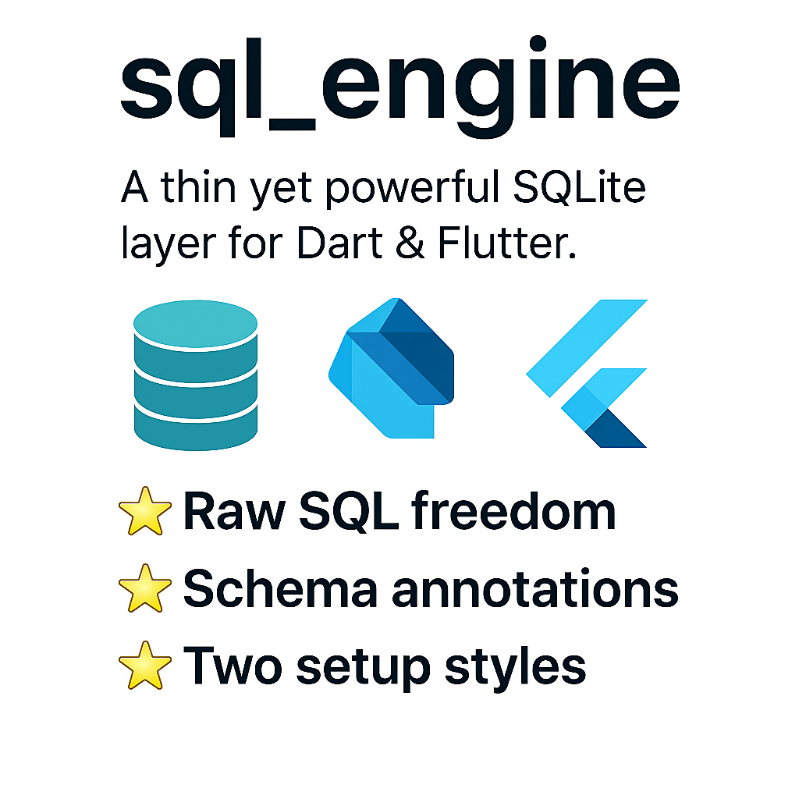

# sql_engine

*A thin yet powerful SQLite layer for Dart & Flutter.*



---

## Key features

- **Raw SQL freedom** – run any statement you like (`JOIN`, `UPSERT`, FTS5…).
- **Schema annotations** – use `@SqlTable` + `@SqlSchema` to generate  
  `CREATE TABLE` scripts *and* versioned migrations automatically.
- **Two setup styles**
    1. *Low‑level* `SqlEngineDatabase` – explicit registration.
    2. *Drift‑style* `@SqlDatabase` – one annotation, everything wired for you.
- **Model mapping** – `fromRow` / `toRow` helpers are generated for each table.
- **Generated CRUD helpers** – just call `UserCrudHelpers.insert(...)` with named args.
- **No mirrors, no hidden allocations** – works on Flutter, server, CLI, Wasm.


---


### Raw bytes helpers *(v 2.0.5)*

New `toBytes()` / `fromBytes()` extension methods are now generated for every model. They serialize a row to a compact `Uint8List` and restore it back – perfect for binary caches, isolate transfers, or network blobs.

```dart
final bytes = user.toBytes();        //  Uint8List
await someCache.put('u1', bytes);

final raw   = await someCache.get('u1');
final user2 = User.fromBytes(raw);   // deep-equal to original
```

Under the hood, the generator packs non-null fields only and writes via `ByteData` for **zero-allocation** encoding.

---


## Soft Delete Support (2.0.4)
To include softDelete on a tabale annotate the table 
@SqlTable(tableName: 'users', version: 1, softDelete: true)
and your table should include `deleted_at`  column (`SqlType.date`) 
the generator enables soft delete behavior:

- `deleteById()` sets `deleted_at = CURRENT_TIMESTAMP`
- `findAll()` and `findWhere()` skip deleted rows by default
- `restoreById()` resets `deleted_at = NULL` to undelete the row
- Pass `includeDeleted: true` to include deleted rows in queries
- refer to test in test/soft_delete_test.dart

### Example

```dart
await UserCrudHelpers.deleteById(db, 2);

final active = await UserCrudHelpers.findAll(db);
final all = await UserCrudHelpers.findAll(db, includeDeleted: true);

await UserCrudHelpers.restoreById(db, 2);
```

`restoreById` is used in a soft delete system to "undo" a deletion by clearing the deleted_at timestamp for a specific record. 
---

##  NEW in 2.0.3: Initial Seed Data

You can now define **seed data** inside your `@SqlSchema` annotation.  
This allows you to auto-populate a table **on first creation only** — great for test users or static defaults.

### Example

```dart
@SqlSchema(
  version: 1,
  columns: [...],
  seedData: [
    {
      'name': 'Alice',
      'male': false,
      'created_at': DateTime(2025, 6, 1).millisecondsSinceEpoch,
    },
    {
      'name': 'Bob',
      'male': true,
      'created_at': DateTime(2025, 6, 2).millisecondsSinceEpoch,
    }
  ],
)
```

Seed data is inserted only if the table is being created for the first time.

Supported value types:
- `int`, `double`, `bool`, `String`, `DateTime` (as `millisecondsSinceEpoch`), `null`

---

## Install

```yaml
dependencies:
  sql_engine: ^2.0.1
  sqlite3: ^2.3.0    # native engine
  build_runner: ^2.4.6
  source_gen: ^1.5.0
```

```bash
flutter pub get
dart run build_runner build --delete-conflicting-outputs
```

---

##  Quick start

### 1. Define a model

```dart
import 'package:sql_engine/sql_engine.dart';

part 'user.g.dart';

@SqlTable(tableName: 'users', version: 1)
@SqlIndex(name: 'idx_user_email', columns: ['email'])

@SqlSchema(
  version: 1,
  columns: [
    SqlColumn(name: 'id', type: SqlType.integer, primaryKey: true, autoincrement: true, nullable: false),
    SqlColumn(name: 'name', type: SqlType.text, nullable: false),
    SqlColumn(name: 'male', type: SqlType.boolean),
    SqlColumn(name: 'created_at', type: SqlType.date),
    SqlColumn(name: 'data', type: SqlType.json),
  ],
)
class User {
  final int? id;
  final String name;
  final bool? male;
  final DateTime? createdAt;
  final Map<String, dynamic>? data;

  User({this.id, required this.name, this.male, this.createdAt, this.data});
}
```

---

### 2A. Manual database (explicit)

```dart
final db = SqlEngineDatabase();

db.registerTable([
  const UserTable(), // generated class
]);

await db.open(); // uses in-memory by default
```

---

##  NEW: CRUD Helper Methods (2.0.1)

Once your model is annotated, the generator will also emit strongly‑typed helpers like:

```dart
UserCrudHelpers.insert(db, id: 1, name: 'Alice', createdAt: DateTime.now());
UserCrudHelpers.deleteById(db, 1);
UserCrudHelpers.update(db, id: 1, name: 'New Name');
UserCrudHelpers.upsert(db, id: 1, name: 'Final Name');
UserCrudHelpers.findAll(db);
UserCrudHelpers.findWhere(db, 'name = ?', ['Alice']);
```

### Full example:

```dart
await UserCrudHelpers.insert(
  db,
  id: 1,
  name: 'Alice',
  male: false,
  createdAt: DateTime.now(),
  data: {'role': 'admin'},
);

await UserCrudHelpers.update(
  db,
  id: 1,
  name: 'Alice Updated',
);

final users = await UserCrudHelpers.findWhere(
  db,
  'name = ?',
  ['Alice Updated'],
);

await UserCrudHelpers.deleteById(db, 1);
```

These are generated per model and are available under `<ModelName>CrudHelpers`.

---

## CRUD cheat‑sheet

### Insert

```dart
await db.runSql(
  'INSERT INTO users (full_name, email) VALUES (?, ?)',
  positionalParams: ['Ada Lovelace', 'ada@history.dev'],
);
```

### Select + mapper

```dart
final users = await db.runSql<List<User>>(
  'SELECT * FROM users WHERE email LIKE ?',
  positionalParams: ['%@history.dev'],
  mapper: (rows) => rows.map(UserMapper.fromRow).toList(),
);
```

### Update

```dart
await db.runSql(
  'UPDATE users SET email = ? WHERE id = ?',
  positionalParams: ['ada@computing.io', 1],
);
```

### Upsert

```dart
await db.runSql(
  '''
  INSERT INTO users (id, full_name)
  VALUES (?, ?)
  ON CONFLICT(id) DO UPDATE SET full_name = excluded.full_name
  ''',
  positionalParams: [1, 'A. Lovelace‑Updated'],
);
```

### Join

```dart
final rows = await db.runSql('''
  SELECT u.full_name, o.total
  FROM users u
  JOIN orders o ON u.id = o.customer_id
  WHERE o.total > ?
''', positionalParams: [100]);
```

---

## Migrations

Add a new `@SqlSchema(version: N+1, …)` block to your model, bump the `@SqlTable(version: N+1)`, run the generator again.

The tool emits idempotent `ALTER TABLE` statements (rename, add, etc.) and stores them inside `UserTable.migrations`.

When you open the database with a higher version value, the engine:

1. Reads `PRAGMA user_version`
2. Runs all missing migrations in order
3. Updates `user_version` to the target

---

## Advanced topics

- FTS5 virtual tables (`CREATE VIRTUAL TABLE … USING fts5`)
- WAL vs DELETE journal modes (`JournalMode.wal`)
- Transactions:

```dart
await db.transaction(() async {
  await db.runSql('INSERT …');
  await db.runSql('UPDATE …');
});
```

- Row ↔ JSON helpers (see `example/`)

---

## Related terms

SQL, SQLite, FTS5, UPSERT, JOIN, WAL, migration, schema, Dart ORM.

---

## Contributing & roadmap

We welcome issues and PRs!

Planned features:
- CLI schema diff viewer
- Code‑first migrations
- Migration rollback helper

See `CONTRIBUTING.md` for details.

---

## Support

- File an issue on the [GitHub tracker](https://github.com/snbrb/sql_engine/issues)
- Or email: bilalrabbi@gmail.com

---

## Acknowledgments

Thanks to my mentor [skn3](https://github.com/skn3) for their support and guidance on this project and beyond!
